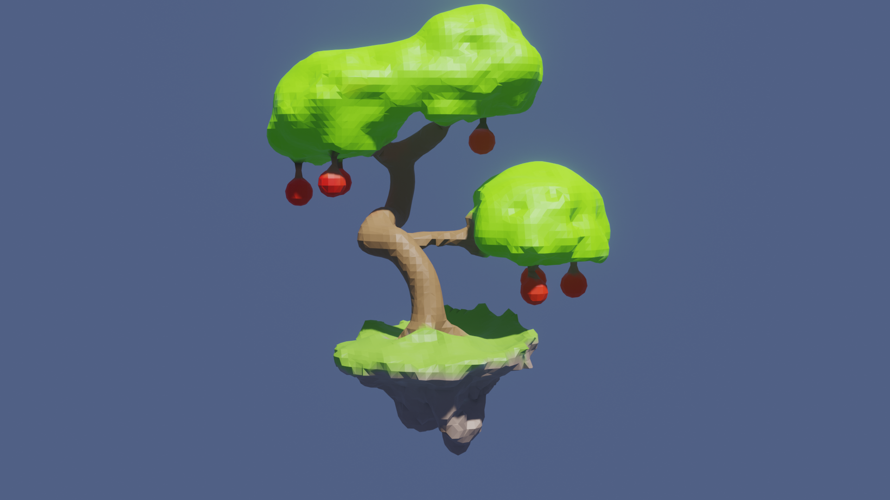

# TP de modélisation Géométrique

Arbre généré avec des unions/différences lissées de Capsules (tige des pommes), Tors
(Haut du socle) et Sphères en lançant des rayons via mon tp, puis paint et rendu sous
blender. Il contient 2035 primitives, 26288 Triangles, 13140 Sommets et prend 2.9
secondes de rendu pour une résolution de 72 dans une boite de (-1.5, -1.0, -1.5), (1.5,
2.5, 1.5). Tirer 10 rayons via un Sphere tracing prend environ 10ms avec une bbox, 1ms
si aucun rayon ne touche. Ce temps est mesuré via l’utilisation d’une Axis Aligned Bounding
Box généré à la main. Mais peut prendre jusqu’à deux secondes sans Bounding Box.

## Création de formes via SDF

- Utilisation des Signed Distance Function assembler dans un arbre pour créer des formes
- Ses formes sont ensuite mailler via Cube Marching
- Pour ajouter des détails, des rayons sont tirer depuis la caméra vers l'objet via control click, une requête spacial via Ray Marching est ensuite lancer vers l'objet en SDF.

## Surfaces de bézier

- Une simple classe qui stock une grille de point en 2D
- Chaque grille est sa propre courbe et est ensuite utiliser pour mailler des surfaces de bézier / révolution

## Librairies

- Imgui est utilisé pour l'UI, afin de pouvoir facilement choisir les formes a appliquer et sculpter la SDF.
- BOOST est utilisé pour sérializer l'arbre SDF afin de pouvoir la reprendre plus tard, faire des sauvegardes, revenir en arrière etc.

```
sudo apt-get install libboost-all-dev
sudo apt-get install libimgui-dev
```

J'ai fait le tp sous une branche local de gkit, j'ai du copier les fichiers sur se repo du coup

Vous trouverez les tps dans projets -> tpImplicite

pour compiler

```
premake5 gmake
make tpImplicite
./bin/tpImplicite
```
